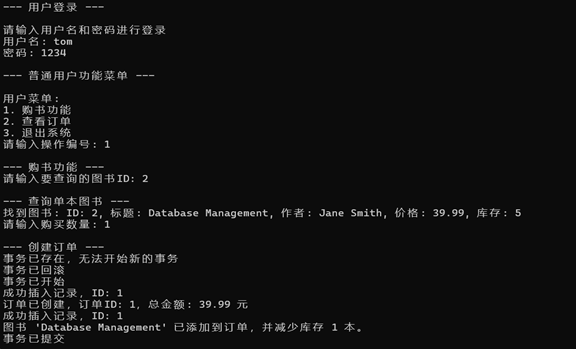
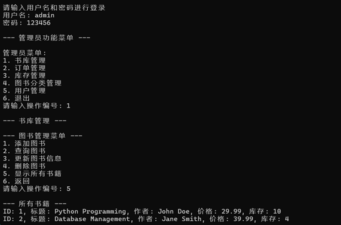

# 目录

- [目录](#目录)
  - [下载地址](#下载地址)
  - [功能](#功能)
  - [程序结构](#程序结构)
  - [介绍](#介绍)
  - [安装和运行方式](#安装和运行方式)
    - [安装python库](#安装python库)
    - [运行程序](#运行程序)
      - [方法一](#方法一)
      - [方法二](#方法二)
  - [注意事项](#注意事项)

**[English](README_en.md) | [简体中文](README.md)**

## 下载地址

[点击此处进行下载](https://github.com/WorldDawnAres/bookstory-mysql/releases)

> 该程序是一个使用MySQL的简单图书管理程序,使用时建议使用MySQL-V8.0.36版本
>
> 欢迎感兴趣的下载体验

## 功能

- [x] 用户管理、用户权限管理
- [x] 书库管理：增加、删除、修改以及查询功能
- [x] 图书分类管理
- [x] 库存管理，以及库存不足时的处理方式
- [x] 购书流程设置
- [x] 订单管理

## 程序结构

```bash
bookstory-mysql
├── /bookstore
│   ├── icon.jpg
│   ├── __init__.py 
│   ├── config.py
│   ├── book_management.py
│   ├── category_management.py
│   ├── database.py
│   ├── inventory_management.py
│   ├── menu_management.py
│   ├── user_management.py
│   └── order_management.py
├── main.py
└── /README.md
```

## 介绍

>这个程序通过cmd命令行界面实现了图书管理系统的基本功能，包括用户管理、图书管理、图书分类管理、库存管理、购书流程设置和订单管理。
>
>程序使用Python编写，并使用了MySQL数据库来存储数据。
>
>下图是程序的界面使用图：





## 安装和运行方式

### 安装python库

>使用以下命令安装所需的Python库:

```bash
pip install mysql-connector-python
pip install PyInstaller(可选)
```

### 运行程序

>你可以使用以下任一方式来运行程序：

#### 方法一

>使用 PyInstaller 打包程序：

```bash
PyInstaller -F --add-data "bookstore/*;bookstore" -i bookstore\icon.jpg main.py
```

>然后在 dist 目录下找到可执行文件。

#### 方法二

>直接运行 Python 脚本：

```bash
python main.py
```

## 注意事项

>该程序使用MySQL数据库，因此需要先安装MySQL数据库，并创建相应的数据库和表。
>
>安装好数据库后在数据库中创建相应的表，可以使用mysql-config.txt文件中的SQL语句来创建表。

[安装mysql教程点此查看](https://blog.csdn.net/m0_71422677/article/details/136007088)
